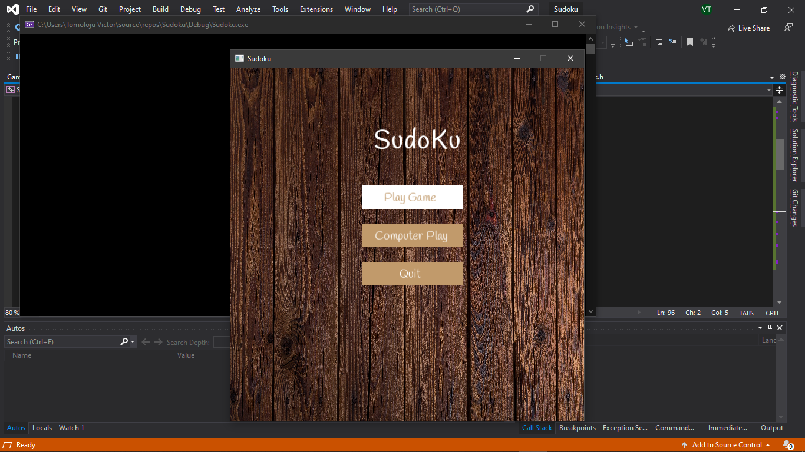
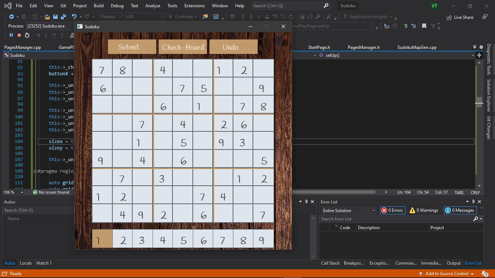

# Sudoku_SFML
Sudoku game made with C++ and SFML 2.5.1 (Static Puzzle for now...) check out GUI2 Branch that uses the Keyboard for gamePlay Input (1-9)

<h3>Game Menu</h3>

 </img>

<h3>GamePlay Page</h3>

 </img>

